# 🎨 Diagramas de Arquitetura - Mermaid

> **Dica**: Estes diagramas podem ser visualizados no GitHub, GitLab, ou em editores que suportam Mermaid (VS Code com extensão, Notion, etc.)

## 📋 Índice

1. [Monolítica](#1-arquitetura-monolítica)
2. [Modular](#2-arquitetura-modular)
3. [SOA](#3-arquitetura-soa)
4. [Microsserviços](#4-arquitetura-de-microsserviços)
5. [Comparações](#5-comparações)

---

## 1. Arquitetura Monolítica

### Diagrama de Componentes

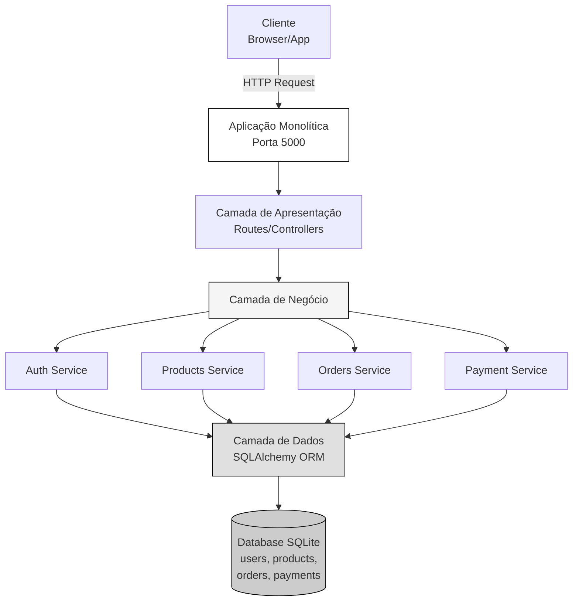
```mermaid
graph TD
    Client[Cliente<br/>Browser/App] -->|HTTP Request| App[Aplicação Monolítica<br/>Porta 5000]
    
    App --> Presentation[Camada de Apresentação<br/>Routes/Controllers]
    Presentation --> Business[Camada de Negócio]
    
    Business --> Auth[Auth Service]
    Business --> Products[Products Service]
    Business --> Orders[Orders Service]
    Business --> Payment[Payment Service]
    
    Auth --> Data[Camada de Dados<br/>SQLAlchemy ORM]
    Products --> Data
    Orders --> Data
    Payment --> Data
    
    Data --> DB[(Database SQLite<br/>users, products,<br/>orders, payments)]
    
    style App fill:#ffffff,stroke:#000000
    style Business fill:#f5f5f5,stroke:#000000
    style Data fill:#e0e0e0,stroke:#000000
    style DB fill:#cccccc,stroke:#000000
```

### Fluxo de Requisição

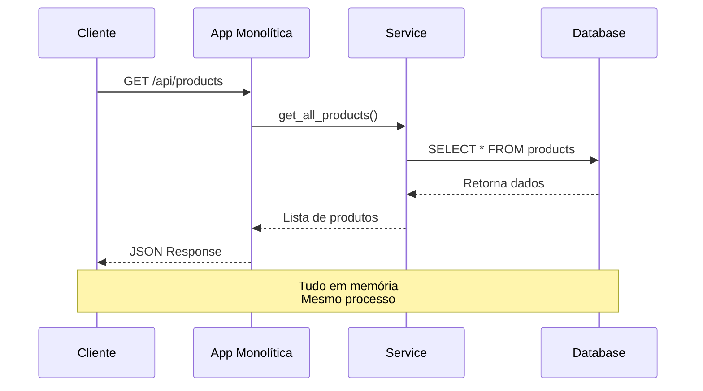
```mermaid
sequenceDiagram
    participant C as Cliente
    participant A as App Monolítica
    participant S as Service
    participant DB as Database
    
    C->>A: GET /api/products
    A->>S: get_all_products()
    S->>DB: SELECT * FROM products
    DB-->>S: Retorna dados
    S-->>A: Lista de produtos
    A-->>C: JSON Response
    
    Note over C,DB: Tudo em memória<br/>Mesmo processo
```

### Estrutura de Camadas

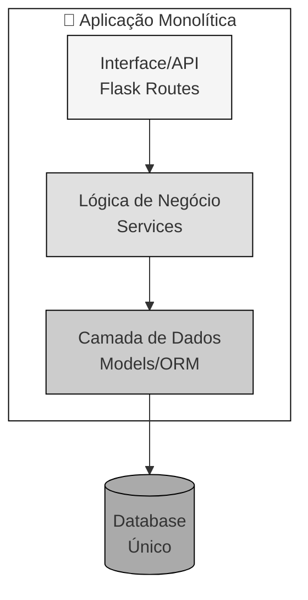
```mermaid
flowchart TB
    subgraph Monolito["🏢 Aplicação Monolítica"]
        direction TB
        UI[Interface/API<br/>Flask Routes]
        BL[Lógica de Negócio<br/>Services]
        DL[Camada de Dados<br/>Models/ORM]
        
        UI --> BL
        BL --> DL
    end
    
    DL --> DB[(Database<br/>Único)]
    
    style Monolito fill:#ffffff,stroke:#000000
    style UI fill:#f5f5f5,stroke:#000000
    style BL fill:#e0e0e0,stroke:#000000
    style DL fill:#cccccc,stroke:#000000
    style DB fill:#aaaaaa,stroke:#000000
```

---

## 2. Arquitetura Modular

### Diagrama de Componentes

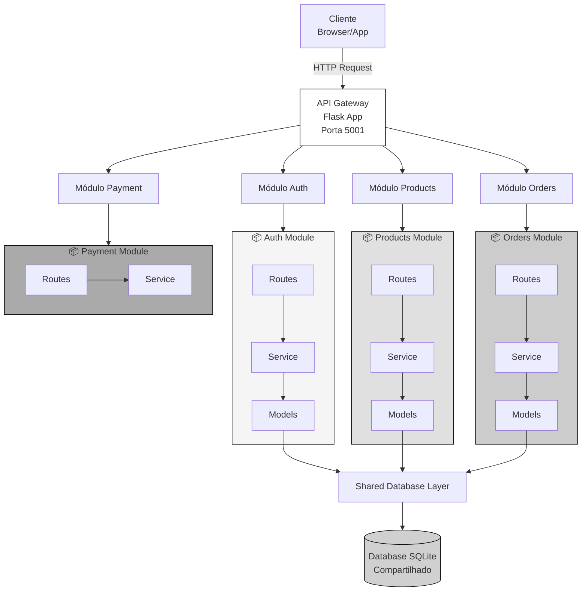
```mermaid
graph TD
    Client[Cliente<br/>Browser/App] -->|HTTP Request| Gateway[API Gateway<br/>Flask App<br/>Porta 5001]
    
    Gateway --> AuthMod[Módulo Auth]
    Gateway --> ProdMod[Módulo Products]
    Gateway --> OrderMod[Módulo Orders]
    Gateway --> PayMod[Módulo Payment]
    
    subgraph AuthModule["📦 Auth Module"]
        AuthRoutes[Routes] --> AuthService[Service]
        AuthService --> AuthModels[Models]
    end
    
    subgraph ProdModule["📦 Products Module"]
        ProdRoutes[Routes] --> ProdService[Service]
        ProdService --> ProdModels[Models]
    end
    
    subgraph OrderModule["📦 Orders Module"]
        OrderRoutes[Routes] --> OrderService[Service]
        OrderService --> OrderModels[Models]
    end
    
    subgraph PayModule["📦 Payment Module"]
        PayRoutes[Routes] --> PayService[Service]
    end
    
    AuthMod --> AuthModule
    ProdMod --> ProdModule
    OrderMod --> OrderModule
    PayMod --> PayModule
    
    AuthModels --> SharedDB[Shared Database Layer]
    ProdModels --> SharedDB
    OrderModels --> SharedDB
    
    SharedDB --> DB[(Database SQLite<br/>Compartilhado)]
    
    style Gateway fill:#ffffff,stroke:#000000
    style AuthModule fill:#f5f5f5,stroke:#000000
    style ProdModule fill:#e0e0e0,stroke:#000000
    style OrderModule fill:#cccccc,stroke:#000000
    style PayModule fill:#aaaaaa,stroke:#000000
    style DB fill:#d0d0d0,stroke:#000000
```

### Comunicação entre Módulos

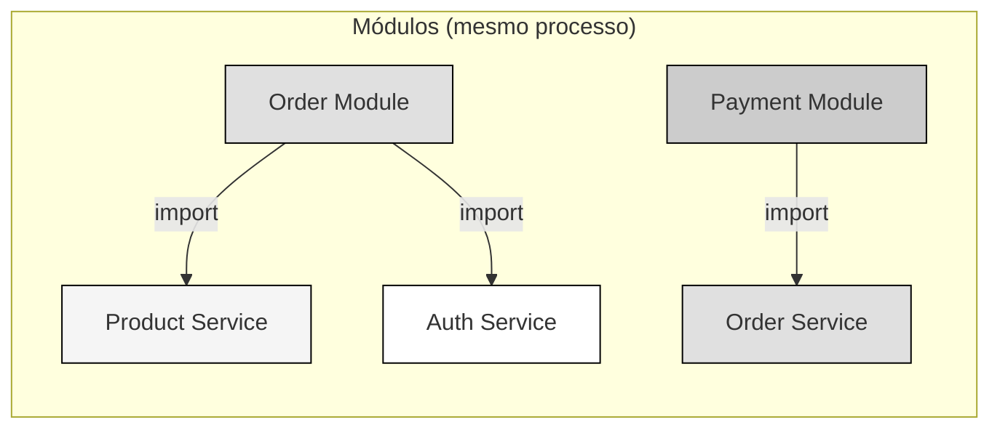
```mermaid
graph LR
    subgraph Modules["Módulos (mesmo processo)"]
        OM[Order Module] -->|import| PS[Product Service]
        OM -->|import| AS[Auth Service]
        PM[Payment Module] -->|import| OS[Order Service]
    end
    
    style OM fill:#e0e0e0,stroke:#000000
    style PM fill:#cccccc,stroke:#000000
    style PS fill:#f5f5f5,stroke:#000000
    style AS fill:#ffffff,stroke:#000000
    style OS fill:#e0e0e0,stroke:#000000
```

### Fluxo de Criação de Pedido

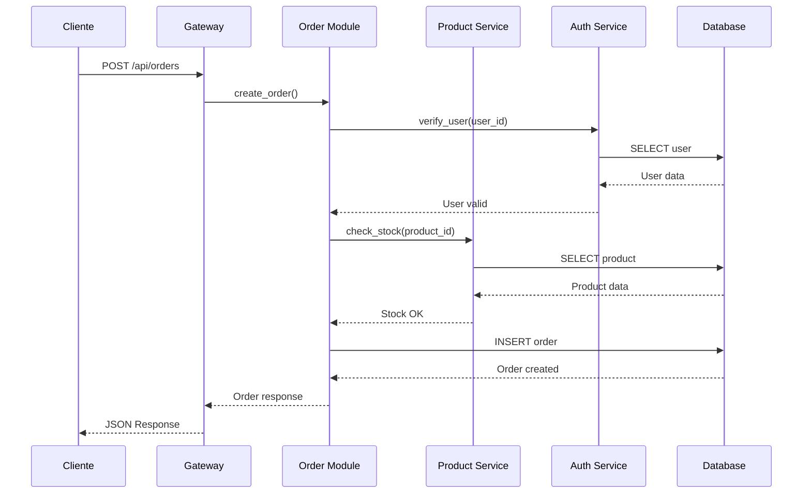
```mermaid
sequenceDiagram
    participant C as Cliente
    participant G as Gateway
    participant OM as Order Module
    participant PS as Product Service
    participant AS as Auth Service
    participant DB as Database
    
    C->>G: POST /api/orders
    G->>OM: create_order()
    OM->>AS: verify_user(user_id)
    AS->>DB: SELECT user
    DB-->>AS: User data
    AS-->>OM: User valid
    OM->>PS: check_stock(product_id)
    PS->>DB: SELECT product
    DB-->>PS: Product data
    PS-->>OM: Stock OK
    OM->>DB: INSERT order
    DB-->>OM: Order created
    OM-->>G: Order response
    G-->>C: JSON Response
```

---

## 3. Arquitetura SOA

### Diagrama de Componentes

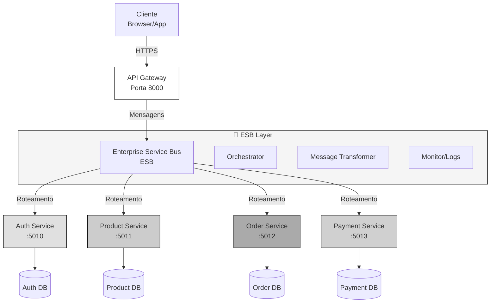
```mermaid
graph TD
    Client[Cliente<br/>Browser/App] -->|HTTPS| Gateway[API Gateway<br/>Porta 8000]
    
    Gateway -->|Mensagens| ESB[Enterprise Service Bus<br/>ESB]
    
    ESB -->|Roteamento| AuthSvc[Auth Service<br/>:5010]
    ESB -->|Roteamento| ProdSvc[Product Service<br/>:5011]
    ESB -->|Roteamento| OrderSvc[Order Service<br/>:5012]
    ESB -->|Roteamento| PaySvc[Payment Service<br/>:5013]
    
    subgraph ESBLayer["🚌 ESB Layer"]
        ESB
        Orch[Orchestrator]
        Transform[Message Transformer]
        Monitor[Monitor/Logs]
    end
    
    AuthSvc --> AuthDB[(Auth DB)]
    ProdSvc --> ProdDB[(Product DB)]
    OrderSvc --> OrderDB[(Order DB)]
    PaySvc --> PayDB[(Payment DB)]
    
    style Gateway fill:#ffffff,stroke:#000000
    style ESBLayer fill:#f5f5f5,stroke:#000000
    style AuthSvc fill:#e0e0e0,stroke:#000000
    style ProdSvc fill:#cccccc,stroke:#000000
    style OrderSvc fill:#aaaaaa,stroke:#000000
    style PaySvc fill:#d0d0d0,stroke:#000000
```

### Orquestração de Serviços

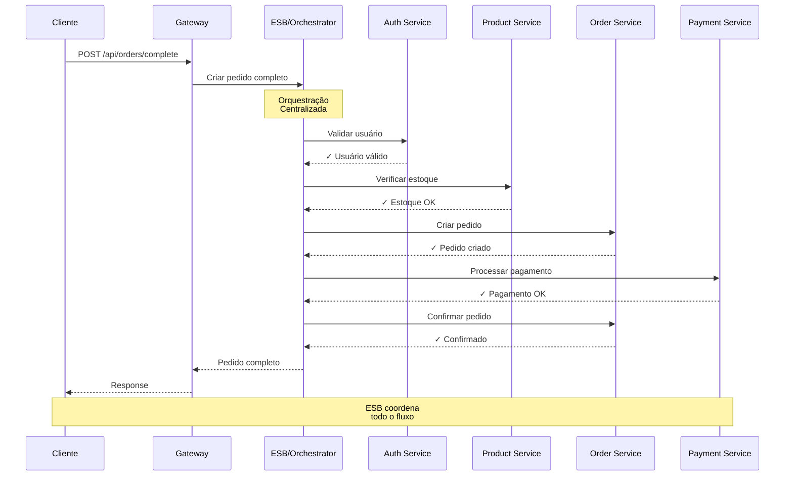
```mermaid
sequenceDiagram
    participant C as Cliente
    participant G as Gateway
    participant ESB as ESB/Orchestrator
    participant AS as Auth Service
    participant PS as Product Service
    participant OS as Order Service
    participant PayS as Payment Service
    
    C->>G: POST /api/orders/complete
    G->>ESB: Criar pedido completo
    
    Note over ESB: Orquestração<br/>Centralizada
    
    ESB->>AS: Validar usuário
    AS-->>ESB: ✓ Usuário válido
    
    ESB->>PS: Verificar estoque
    PS-->>ESB: ✓ Estoque OK
    
    ESB->>OS: Criar pedido
    OS-->>ESB: ✓ Pedido criado
    
    ESB->>PayS: Processar pagamento
    PayS-->>ESB: ✓ Pagamento OK
    
    ESB->>OS: Confirmar pedido
    OS-->>ESB: ✓ Confirmado
    
    ESB-->>G: Pedido completo
    G-->>C: Response
    
    Note over C,PayS: ESB coordena<br/>todo o fluxo
```

### Fluxo de Mensagens no ESB

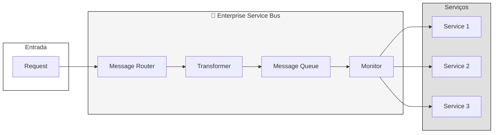
```mermaid
flowchart LR
    subgraph Input["Entrada"]
        Req[Request]
    end
    
    subgraph ESB["🚌 Enterprise Service Bus"]
        Router[Message Router]
        Transform[Transformer]
        Queue[Message Queue]
        Monitor[Monitor]
        
        Router --> Transform
        Transform --> Queue
        Queue --> Monitor
    end
    
    subgraph Services["Serviços"]
        S1[Service 1]
        S2[Service 2]
        S3[Service 3]
    end
    
    Req --> Router
    Monitor --> S1
    Monitor --> S2
    Monitor --> S3
    
    style ESB fill:#f5f5f5,stroke:#000000
    style Input fill:#ffffff,stroke:#000000
    style Services fill:#e0e0e0,stroke:#000000
```

---

## 4. Arquitetura de Microsserviços

### Diagrama de Componentes

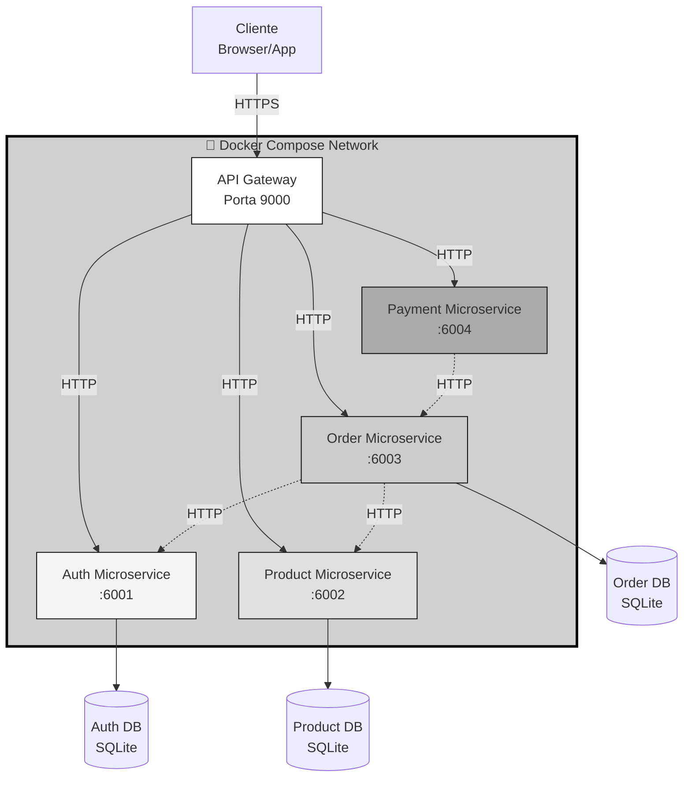
```mermaid
graph TD
    Client[Cliente<br/>Browser/App] -->|HTTPS| Gateway[API Gateway<br/>Porta 9000]
    
    Gateway -->|HTTP| AuthMS[Auth Microservice<br/>:6001]
    Gateway -->|HTTP| ProdMS[Product Microservice<br/>:6002]
    Gateway -->|HTTP| OrderMS[Order Microservice<br/>:6003]
    Gateway -->|HTTP| PayMS[Payment Microservice<br/>:6004]
    
    OrderMS -.->|HTTP| AuthMS
    OrderMS -.->|HTTP| ProdMS
    PayMS -.->|HTTP| OrderMS
    
    AuthMS --> AuthDB[(Auth DB<br/>SQLite)]
    ProdMS --> ProdDB[(Product DB<br/>SQLite)]
    OrderMS --> OrderDB[(Order DB<br/>SQLite)]
    
    subgraph Docker["🐳 Docker Compose Network"]
        Gateway
        AuthMS
        ProdMS
        OrderMS
        PayMS
    end
    
    style Gateway fill:#ffffff,stroke:#000000
    style AuthMS fill:#f5f5f5,stroke:#000000
    style ProdMS fill:#e0e0e0,stroke:#000000
    style OrderMS fill:#cccccc,stroke:#000000
    style PayMS fill:#aaaaaa,stroke:#000000
    style Docker fill:#d0d0d0,stroke:#000000,stroke-width:3px
```

### Comunicação entre Microsserviços

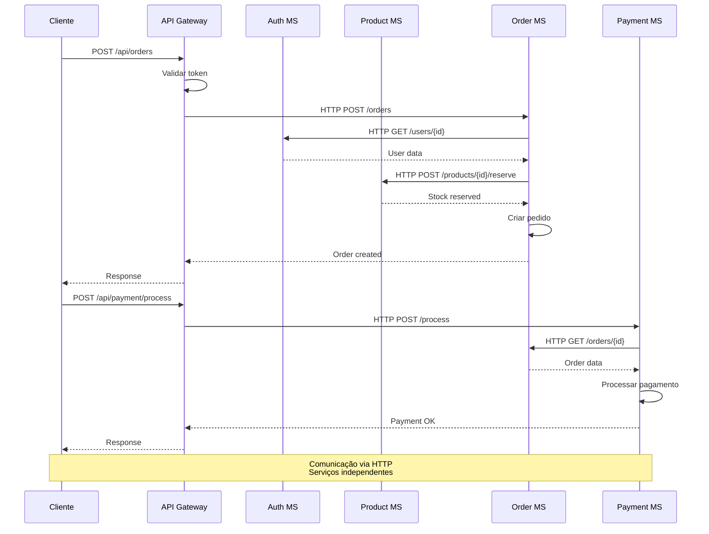
```mermaid
sequenceDiagram
    participant C as Cliente
    participant G as API Gateway
    participant AS as Auth MS
    participant PS as Product MS
    participant OS as Order MS
    participant PayS as Payment MS
    
    C->>G: POST /api/orders
    G->>G: Validar token
    G->>OS: HTTP POST /orders
    
    OS->>AS: HTTP GET /users/{id}
    AS-->>OS: User data
    
    OS->>PS: HTTP POST /products/{id}/reserve
    PS-->>OS: Stock reserved
    
    OS->>OS: Criar pedido
    OS-->>G: Order created
    G-->>C: Response
    
    C->>G: POST /api/payment/process
    G->>PayS: HTTP POST /process
    PayS->>OS: HTTP GET /orders/{id}
    OS-->>PayS: Order data
    PayS->>PayS: Processar pagamento
    PayS-->>G: Payment OK
    G-->>C: Response
    
    Note over C,PayS: Comunicação via HTTP<br/>Serviços independentes
```

### Arquitetura de Containers

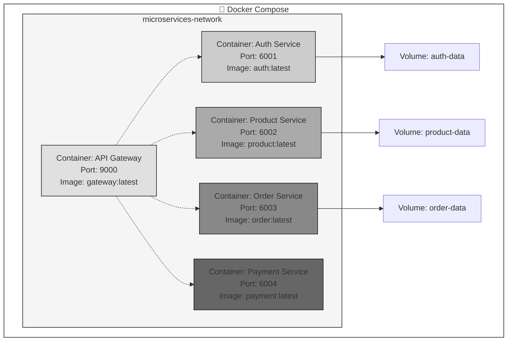
```mermaid
graph TB
    subgraph DockerCompose["🐳 Docker Compose"]
        subgraph Network["microservices-network"]
            GW[Container: API Gateway<br/>Port: 9000<br/>Image: gateway:latest]
            
            Auth[Container: Auth Service<br/>Port: 6001<br/>Image: auth:latest]
            Prod[Container: Product Service<br/>Port: 6002<br/>Image: product:latest]
            Order[Container: Order Service<br/>Port: 6003<br/>Image: order:latest]
            Pay[Container: Payment Service<br/>Port: 6004<br/>Image: payment:latest]
            
            GW -.-> Auth
            GW -.-> Prod
            GW -.-> Order
            GW -.-> Pay
        end
        
        Auth --> VAuth[Volume: auth-data]
        Prod --> VProd[Volume: product-data]
        Order --> VOrder[Volume: order-data]
    end
    
    style DockerCompose fill:#ffffff,stroke:#000000
    style Network fill:#f5f5f5,stroke:#000000
    style GW fill:#e0e0e0,stroke:#000000
    style Auth fill:#cccccc,stroke:#000000
    style Prod fill:#aaaaaa,stroke:#000000
    style Order fill:#888888,stroke:#000000
    style Pay fill:#666666,stroke:#000000
```

### Escalabilidade Horizontal

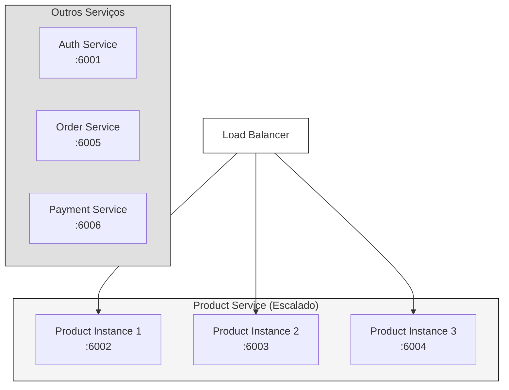
```mermaid
graph TB
    LB[Load Balancer]
    
    subgraph ProductService["Product Service (Escalado)"]
        PS1[Product Instance 1<br/>:6002]
        PS2[Product Instance 2<br/>:6003]
        PS3[Product Instance 3<br/>:6004]
    end
    
    subgraph OtherServices["Outros Serviços"]
        Auth[Auth Service<br/>:6001]
        Order[Order Service<br/>:6005]
        Pay[Payment Service<br/>:6006]
    end
    
    LB --> PS1
    LB --> PS2
    LB --> PS3
    
    style ProductService fill:#f5f5f5,stroke:#000000
    style OtherServices fill:#e0e0e0,stroke:#000000
    style LB fill:#ffffff,stroke:#000000
```

---

## 5. Comparações

### Evolução de Arquitetura

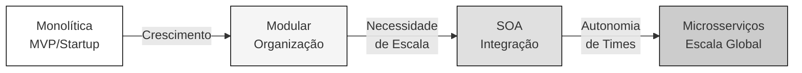
```mermaid
graph LR
    A[Monolítica<br/>MVP/Startup] -->|Crescimento| B[Modular<br/>Organização]
    B -->|Necessidade<br/>de Escala| C[SOA<br/>Integração]
    C -->|Autonomia<br/>de Times| D[Microsserviços<br/>Escala Global]
    
    style A fill:#ffffff,stroke:#000000
    style B fill:#f5f5f5,stroke:#000000
    style C fill:#e0e0e0,stroke:#000000
    style D fill:#cccccc,stroke:#000000
```

### Comparação de Deploy

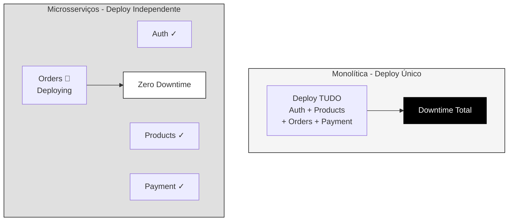
```mermaid
graph TB
    subgraph Monolithic["Monolítica - Deploy Único"]
        M1[Deploy TUDO<br/>Auth + Products<br/>+ Orders + Payment]
        M1 --> MD[Downtime Total]
    end
    
    subgraph Microservices["Microsserviços - Deploy Independente"]
        MS1[Auth ✓]
        MS2[Products ✓]
        MS3[Orders 🔄<br/>Deploying]
        MS4[Payment ✓]
        
        MS3 --> MSD[Zero Downtime]
    end
    
    style Monolithic fill:#f5f5f5,stroke:#000000
    style Microservices fill:#e0e0e0,stroke:#000000
    style MD fill:#000000,stroke:#000000,color:#ffffff
    style MSD fill:#ffffff,stroke:#000000
```

### Comparação de Banco de Dados

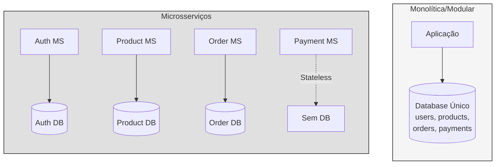
```mermaid
graph TB
    subgraph Mono["Monolítica/Modular"]
        direction TB
        App1[Aplicação]
        App1 --> DB1[(Database Único<br/>users, products,<br/>orders, payments)]
    end
    
    subgraph Micro["Microsserviços"]
        direction TB
        MS1[Auth MS] --> DB2[(Auth DB)]
        MS2[Product MS] --> DB3[(Product DB)]
        MS3[Order MS] --> DB4[(Order DB)]
        MS4[Payment MS] -.->|Stateless| NoDB[Sem DB]
    end
    
    style Mono fill:#f5f5f5,stroke:#000000
    style Micro fill:#e0e0e0,stroke:#000000
```

### Complexidade vs Benefícios

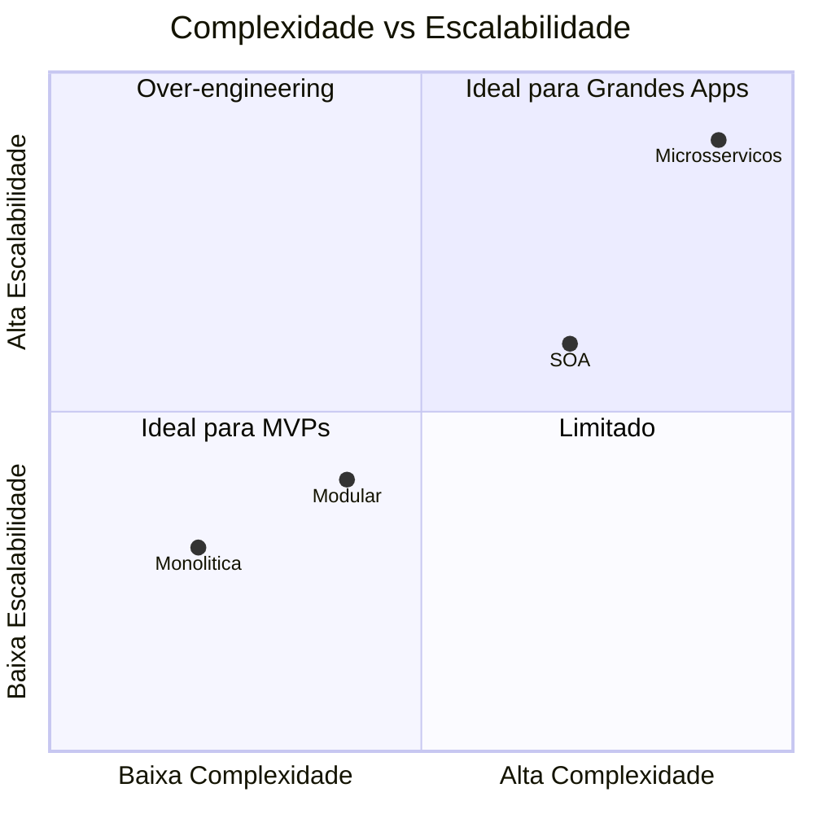
```mermaid
quadrantChart
    title Complexidade vs Escalabilidade
    x-axis Baixa Complexidade --> Alta Complexidade
    y-axis Baixa Escalabilidade --> Alta Escalabilidade
    quadrant-1 Ideal para Grandes Apps
    quadrant-2 Over-engineering
    quadrant-3 Ideal para MVPs
    quadrant-4 Limitado
    Monolitica: [0.2, 0.3]
    Modular: [0.4, 0.4]
    SOA: [0.7, 0.6]
    Microsservicos: [0.9, 0.9]
```

### Fluxo de Requisição - Comparação

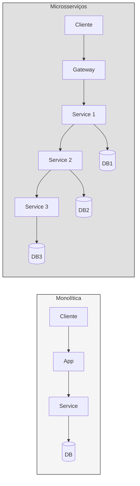
```mermaid
graph LR
    subgraph Monolith["Monolítica"]
        C1[Cliente] --> A1[App]
        A1 --> S1[Service]
        S1 --> D1[(DB)]
    end
    
    subgraph Microservices["Microsserviços"]
        C2[Cliente] --> G2[Gateway]
        G2 --> MS1[Service 1]
        MS1 --> MS2[Service 2]
        MS2 --> MS3[Service 3]
        MS1 --> DB2[(DB1)]
        MS2 --> DB3[(DB2)]
        MS3 --> DB4[(DB3)]
    end
    
    style Monolith fill:#f5f5f5,stroke:#000000
    style Microservices fill:#e0e0e0,stroke:#000000
```

### Decisão de Arquitetura

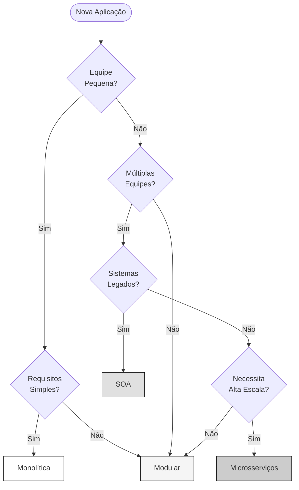
```mermaid
flowchart TD
    Start([Nova Aplicação]) --> Q1{Equipe<br/>Pequena?}
    
    Q1 -->|Sim| Q2{Requisitos<br/>Simples?}
    Q1 -->|Não| Q4{Múltiplas<br/>Equipes?}
    
    Q2 -->|Sim| Mono[Monolítica]
    Q2 -->|Não| Modular[Modular]
    
    Q4 -->|Sim| Q5{Sistemas<br/>Legados?}
    Q4 -->|Não| Modular
    
    Q5 -->|Sim| SOA[SOA]
    Q5 -->|Não| Q6{Necessita<br/>Alta Escala?}
    
    Q6 -->|Sim| Micro[Microsserviços]
    Q6 -->|Não| Modular
    
    style Mono fill:#ffffff,stroke:#000000
    style Modular fill:#f5f5f5,stroke:#000000
    style SOA fill:#e0e0e0,stroke:#000000
    style Micro fill:#cccccc,stroke:#000000
```

---

**FIAP Pós Tech - DevOps e Arquitetura Cloud**